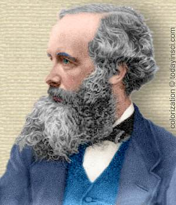
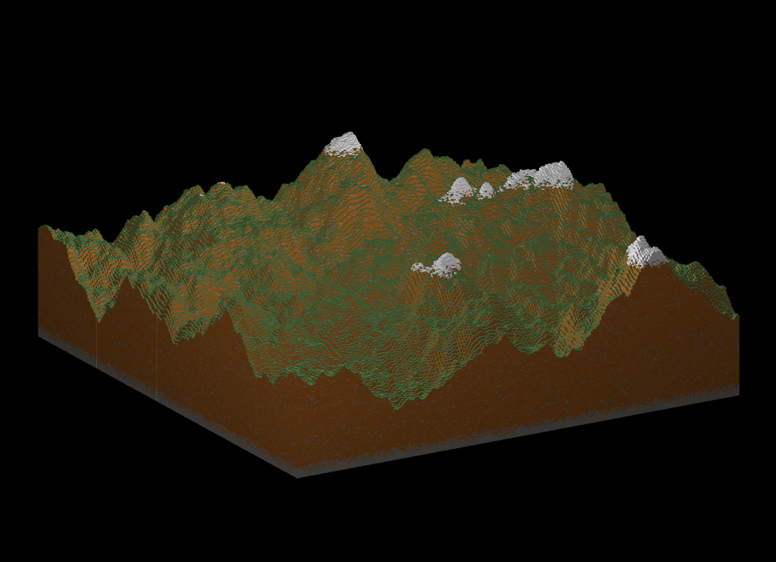
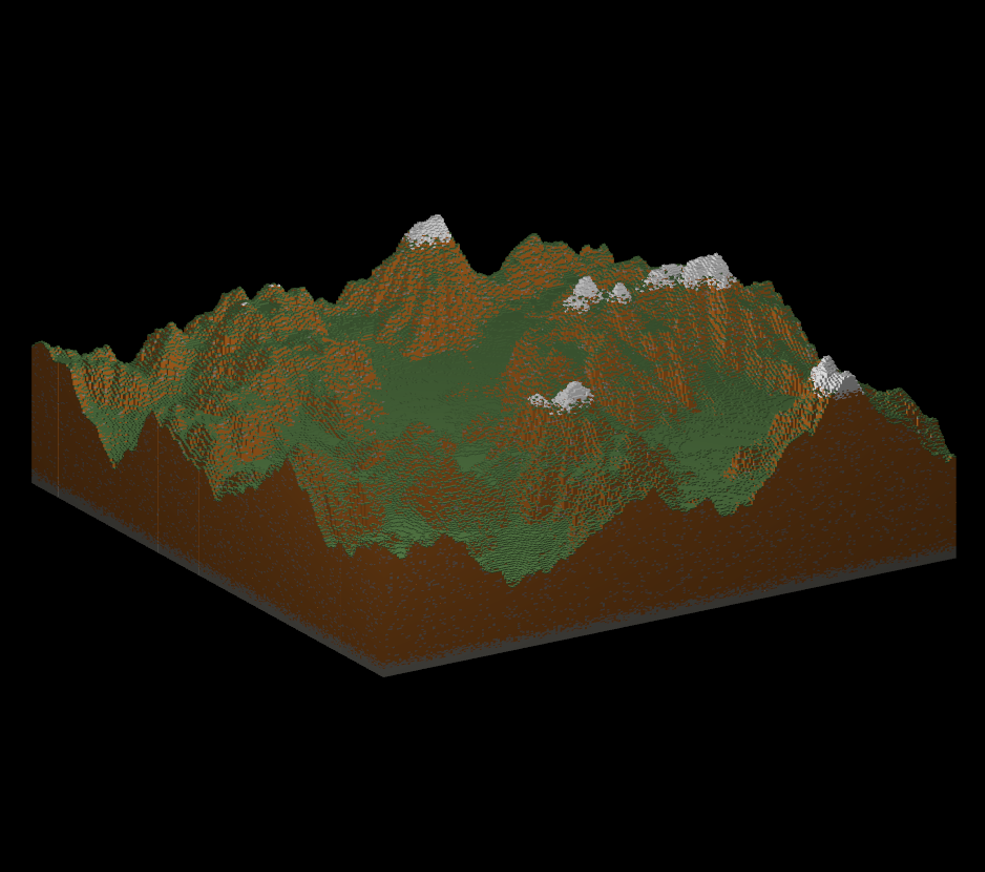

<!-- PROJECT LOGO -->
 

  

  <h3 align="center">mwVoxel</h3>

  

    A voxel engine built atop my Maxwell Engine Architecture. The engine supports rendering the rendering chunks of voxels axis aligned on a uniform grid. The engine can also handle rendering a single chunk with 16.7 million voxels. (256x256x256). 
     
    <h3>Terrain Generation</h3>
    Aside from just general support for voxels, the engine also builds a terrain from a customizable noise generator with FastNoise2. It stores the result in a accumulated heightmap from the noise at 3 different frequencies.
     
    <h3> Hydraulic Erosion </h3>
    After a heightmap has been generated, the engine is also capable of
    simulating hydraulic erosion using a simple, classical mechanics based, hydraulic erosion simulating.
     
  

### Built With

* [OpenGL](https://www.opengl.org//)
* [Dear Imgui](https://github.com/ocornut/imgui)
* [ASSIMP](https://www.assimp.org/)
* [C++](https://www.cplusplus.com/)
* [GLFW](https://www.glfw.org/)
* [FastNoise2](https://github.com/Auburn/FastNoise2)

(<a href="#top">back to top</a>)

## Examples

No Particle Simulated Hydraulic Erosion (16.7 million voxels)
</img>

Hydraulic Erosion Particle Simulaton w/ 150k Particles (16.7 million voxels)
</img>

<!-- CONTACT -->
## Contact

Brennen Green - [@TheBrennenGreen](https://twitter.com/your_username) - brennengreen@outlook.com

(<a href="#top">back to top</a>)

